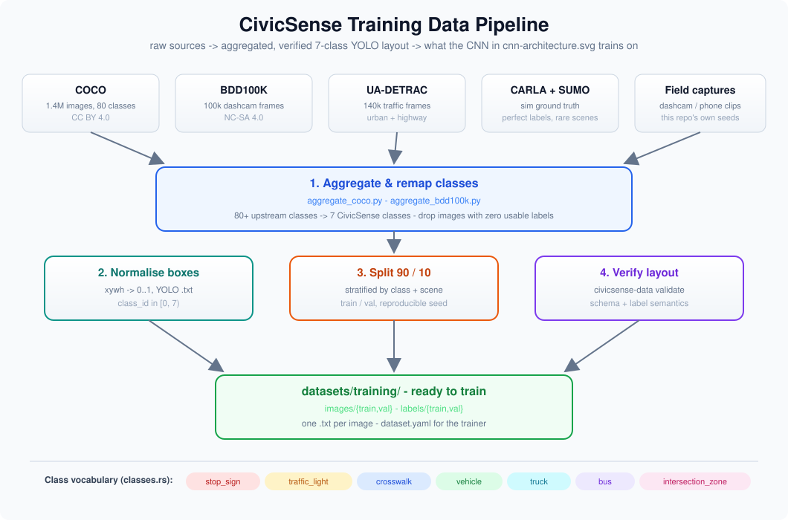
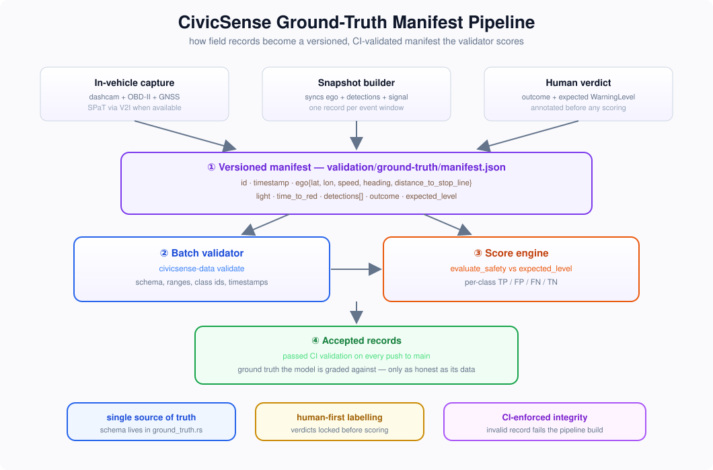

# 🅿️ CivicSense Data Pack

> *"A model is only as honest as the data it's graded on."*
> Data, labels, and ground truth that keep CivicSense's perception honest. MIT-licensed, community-contributed.

**The official training-dataset pack and field-validation ground-truth repository for [driving-civicsense-vision-model](https://github.com/arpanpathak/driving-civicsense-vision-model), an edge-AI co-pilot for intersection discipline, lane courtesy, and road-hazard alerts.**

[](LICENSE)
[](CONTRIBUTING.md)
<br>
[](https://github.com/arpanpathak/driving-civic-sense-data-crowd/actions)
<br>
[](https://www.rust-lang.org)
[](https://github.com/ultralytics/ultralytics)
[](https://cocodataset.org/)
[](https://www.lds.ac.cn/dataset/bdd100k)
[](https://detrac-db.rit.albany.edu/)
[](https://carla.org/)
[](https://eclipse.dev/sumo/)
<br>
[](https://github.com/arpanpathak/driving-civicsense-vision-model)

---

## 📑 Index

- [Why this repo exists](#why-this-repo-exists)
- [Training data pipeline](#training-data-pipeline)
- [Field-validation ground truth](#field-validation-ground-truth)
- [The 7-class vocabulary](#the-7-class-vocabulary)
- [Repository layout](#repository-layout)
- [Quick start](#quick-start)
- [Ground-truth schema](#ground-truth-schema)
- [Aggregating public datasets](#aggregating-public-datasets)
- [CI](#ci)
- [License](#license)
- [Contributing](#contributing)

---

## Why this repo exists

CivicSense is built on two pillars:

1. **A perception model.** A YOLOv8n / YOLOv11n detector over **7 classes**.
2. **A zero-training kinematic decision engine.** A formal, provable rule
   pipeline (dilemma zone, lead-vehicle, cut-in, red/yellow/stale rules)
   that decides *when* to warn.

Both pillars need data, but they need **different kinds of data**:

- **Training data**: labelled images of the 7 classes in YOLO format that
  `civicsense train prepare` can consume.
- **Validation data**: labelled *field ground truth* (synchronised ego
  telemetry, detections, signal phase, and the outcome a correct
  driver+co-pilot should reach) from which we compute a confusion matrix
  over false positives and false negatives.

This repository is the single home for both. It deliberately ships **no
pixels in git**; instead it provides the schema, the validators, the
public-dataset aggregation tooling, and a seed ground-truth manifest.

---

## Training data pipeline

Public datasets, simulators and field captures flow through an aggregator,
then a strict validator, into the training layout CivicSense consumes:

<p align="center">
  
</p>

## Field-validation ground truth

A synchronised snapshot is fed to the decision engine, compared against a
human-annotated expected verdict, and scored into a confusion matrix:

<p align="center">
  
</p>

---

## The 7-class vocabulary

These class ids **must match** `ModelConfig::classes` in the main repo's
`src/config.rs` and `configs/dataset.yaml`:

| `class_id` | Name | Notes |
|------------|------|-------|
| 0 | `stop_sign` | Stop sign ahead. |
| 1 | `traffic_light` | Signal head (red/yellow/green). |
| 2 | `crosswalk` | Pedestrian crossing markings. |
| 3 | `vehicle` | Passenger car / motorcycle / generic. |
| 4 | `truck` | Heavy truck. |
| 5 | `bus` | Bus. |
| 6 | `intersection_zone` | The junction-entrance grid the decision engine checks for occupancy. |

Mirrored in Rust as `civicsense_data_pack::classes::CLASS_NAMES` and in
Python as `civicsense_datapack.schema.CIVICSENSE_CLASSES`. The validators
reject any label whose `class_id` falls outside `0..7`.

---

## Repository layout

```text
driving-civic-sense-data-crowd/
├── Cargo.toml            # Rust validator crate + CLI
├── src/
│   ├── classes.rs        # canonical 7-class vocabulary (single source of truth)
│   ├── yolo.rs           # YOLO .txt label parser/validator
│   ├── dataset.rs        # images/ ↔ labels/ split-layout validator
│   ├── ground_truth.rs   # field-validation record schema + batch validator
│   └── bin/civicsense-data.rs  # the CLI front-end
├── python/
│   └── civicsense_datapack/    # aggregation tooling (COCO, BDD100K)
│       ├── schema.py
│       ├── aggregate_coco.py
│       └── aggregate_bdd100k.py
├── scripts/
│   └── download_public.sh
├── assets/
│   ├── training-pipeline.svg     # training data flow diagram
│   └── ground-truth-pipeline.svg # field-validation flow diagram
├── validation/
│   └── ground-truth/manifest.json   # seed field-validation records
├── datasets/training/    # images/{train,val} + labels/{train,val} (gitkeeps)
├── docs/
│   └── DATA_LICENSES.md
├── LICENSE               # MIT
└── Makefile
```

---

## Quick start

### 1. Validate code (Rust)

Requires Rust 1.96+.

```bash
make validate      # cargo test (unit + doc-tests + integration)
make lint          # cargo clippy -- -D warnings && cargo fmt --check
```

### 2. Validate a training split

```bash
cargo run --bin civicsense-data -- training datasets/training
```

### 3. Validate a YOLO label file

```bash
cargo run --bin civicsense-data -- labels frame_000042.txt
```

### 4. Validate field ground-truth

```bash
cargo run --bin civicsense-data -- ground-truth validation/ground-truth/manifest.json
```

### 5. Fetch & aggregate public datasets

```bash
make download

# or run the aggregator explicitly:
cd python
PYTHONPATH=. python3 -m civicsense_datapack.aggregate_coco \
    --coco-ann ../data/raw/coco_annotations/annotations/instances_train2017.json \
    --coco-images ../data/raw/coco_images \
    --out ../datasets/training \
    --split train
```

> **Heavy images are opt-in.** Run `./scripts/download_public.sh --images`
> to pull the ~19 GB COCO archive. Read [`docs/DATA_LICENSES.md`](docs/DATA_LICENSES.md)
> first.

---

## Ground-truth schema

The kinematic engine is formal, but a proof only transfers to the real
world if evaluated against **labelled reality**. Each record in
`validation/ground-truth/manifest.json` is a synchronised snapshot mapped
1:1 onto the engine's inputs, plus the human-annotated verdict:

```jsonc
{
  "id": "gt_seed_002_yellow_dilemma",
  "scenario": "Oak & 1st, dilemma-zone approach",
  "mode": "simulator",                 // manual | v2i | simulator
  "light": "yellow",                   // red | yellow | green | unknown
  "time_to_red": 2.4,
  "outcome": "blocked",                // stopped | cleared | blocked
  "expected_level": "critical",        // safe | caution | warning | critical
  "ego": { "speed": 14.0, "distance_to_stop_line": 25.0 },
  "detections": []
}
```

A batch of these yields **precision, recall, and latency** (and a
false-positive/false-negative breakdown) exactly as the research paper
describes (Section VI, "Field evaluation data").

**Seed records** cover the canonical cases:

- `green_clear` → **safe**
- `yellow_dilemma` → **critical**
- `red_stop` → **critical**
- `lead_blocking` → **warning**
- `cutin_right` → **warning**

---

## Aggregating public datasets

| Source | Class overlap | Script | License |
|--------|--------------|--------|---------|
| COCO 2017 | car/motorcycle/bus/truck → vehicle/truck/bus; traffic light; stop sign | `aggregate_coco.py` | CC BY 4.0 |
| BDD100K | car/bus/truck/other vehicle; traffic light; stop sign | `aggregate_bdd100k.py` | CC BY-NC-SA 4.0 |
| UA-DETRAC | dense urban vehicles | (pattern follows the same code) | research request |
| CARLA / SUMO | simulator ground truth → field records | see `generate` guidance | per-project |

Each script maps upstream categories to CivicSense classes, filters to
images that carry **at least one** usable label, copies the pixels, and
writes normalised YOLO labels; all output is then verified by the Rust
validator so no malformed label ever enters the training pipeline.

---

## CI

Every push to `main` runs: `cargo build`, `cargo test`, `cargo clippy -D warnings`,
`cargo fmt --check`, and the Python schema tests. CI status is live from GitHub
Actions via the badge at the top of this README.

---

## License

**Code:** MIT, you can use, fork, modify, and redistribute freely, even
commercially.

**Data:** *not owned by this repo.* Each upstream dataset retains its own
license and terms (COCO is CC BY 4.0, BDD100K is CC BY-NC-SA 4.0, etc.).
See [`docs/DATA_LICENSES.md`](docs/DATA_LICENSES.md) before redistributing
any derived pack, and record provenance for anything you contribute.

---

## Contributing

We need **data labelers**, **field testers**, and **tooling engineers**.
All contributions **must pass**:

```bash
make validate && make lint && PYTHONPATH=python python3 python/tests/test_schema.py
```

See [`CONTRIBUTING.md`](CONTRIBUTING.md). Help us turn every mile into a
socially aware mile.

---

<div align="center">

*"Traffic should be cooperative, not competitive."*

**Contribute data. Sharpen the model. Make the math backable.**

</div>
